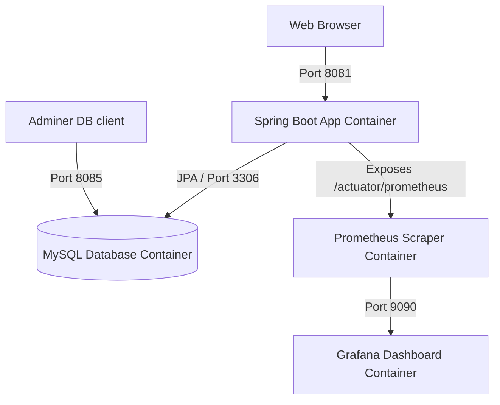
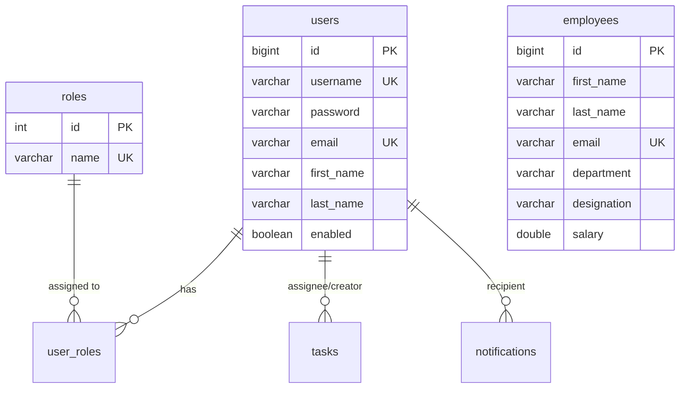

# Project Synopsis & Report: DevOps Employee Portal

This document contains a formal project synopsis and a comprehensive project report for the **DevOps Employee Portal**, an enterprise-grade Java Spring Boot application integrated with a modern DevOps lifecycle pipeline.

---

## Part 1: Project Synopsis

### 1. Project Title
**Automated Java Web Application Deployment using CI/CD Pipeline and Microservices Monitoring**

### 2. Objective & Scope
The objective of this project is to design, develop, and automate the deployment of a role-based Employee Management Portal. The project goes beyond traditional software development by demonstrating a complete production-ready DevOps pipeline. 

The scope includes:
*   Developing a secure Java Spring Boot web application.
*   Automating builds and testing using Apache Maven.
*   Creating a continuous integration and deployment (CI/CD) pipeline via Jenkins.
*   Containerizing application services using Docker and Docker Compose.
*   Orchestrating container deployment and scaling via Kubernetes.
*   Implementing application performance monitoring (APM) using Prometheus and Grafana.

### 3. Key Modules
1.  **Authentication & RBAC (Role-Based Access Control)**: Secure login, registration, and role assignment (`ROLE_USER` and `ROLE_ADMIN`) using Spring Security.
2.  **Employee Directory**: Complete CRUD features to manage employee records (department, designation, salary).
3.  **Task & Notifications Management**: Task assignment workflow between Admins and Users, coupled with an unread notification dispatch system.
4.  **Admin Panel**: Simulated DevOps dashboard including custom views for container logs, pipeline steps, and cluster topology.
5.  **Telemetry & Metrics**: Real-time metrics collection using Spring Boot Actuator.

### 4. Technical Stack
*   **Backend**: Java 17, Spring Boot 3.2.5, Spring Security, Spring Data JPA
*   **Database**: MySQL 8.0, H2 (for unit tests)
*   **Frontend**: HTML5, Thymeleaf, Vanilla CSS (Glassmorphism theme), Bootstrap 5
*   **CI/CD & Containerization**: Jenkins (Declarative Pipeline), Docker, Docker Compose
*   **Orchestration**: Kubernetes (YAML Manifests)
*   **Monitoring**: Prometheus, Grafana

---

## Part 2: Comprehensive Project Report

### 1. Introduction
Modern software engineering requires rapid, reliable, and observable software delivery. This project implements a fully integrated DevOps pipeline for a secure, multi-role employee management application. By integrating containerization (Docker) and orchestration (Kubernetes) with a declarative CI/CD pipeline (Jenkins) and telemetry (Prometheus & Grafana), the project achieves automated quality assurance, zero-downtime rolling updates, and complete system observability.

---

### 2. System Architecture
The application utilizes a classic multi-tier architecture containerized within a unified Docker network:



1.  **Presentation Layer**: Responsive web views rendered dynamically using Thymeleaf templates styled with customized glassmorphic CSS rules.
2.  **Application Layer**: Spring Boot controller classes handling user actions, REST endpoints (`/api/employees`), and advice controllers.
3.  **Persistence Layer**: Spring Data JPA mapping Java entity models to a MySQL relational database schema.
4.  **Monitoring Layer**: Prometheus periodically scrapes JVM metrics from the `/actuator/prometheus` endpoint, which Grafana visualizes in real-time dashboards.

---

### 3. Database Design
The relational schema comprises five tables mapped to Spring Data JPA entities, configured in `schema.sql`:



---

### 4. CI/CD Pipeline Implementation (Jenkinsfile)
The deployment lifecycle is managed through a declarative Jenkins pipeline (`Jenkinsfile`), divided into six sequential stages:

1.  **Checkout Source**: Checks out the latest source code from the GitHub repository.
2.  **Build & Lint**: Compiles the source files using Maven:
    ```bash
    mvn clean compile
    ```
3.  **Execute Tests**: Runs the unit test suite and generates XML test reports:
    ```bash
    mvn test
    ```
4.  **Dockerize Image**: Compiles the final production JAR (`mvn package -DskipTests`) and builds a Docker container image labeled with the build number.
5.  **Push to Registry**: Authenticates with Docker Hub and uploads the image tags (`latest` and versioned).
6.  **Kubernetes Deploy**: Applies database and application manifests to the Kubernetes cluster and triggers a zero-downtime rolling update.

---

### 5. Containerization & Orchestration

#### Docker Compose
For local development, a multi-container stack is declared in `docker-compose.yml`:
*   `devops-mysql`: Runs a MySQL database initialized with `schema.sql`.
*   `devops-app`: Exposes the web app on port **8081** (protecting port `8080` for Jenkins).
*   `devops-prometheus`: Scrapes metrics from the app.
*   `devops-grafana`: Imports customized telemetry dashboards.
*   `devops-adminer`: Web client for database inspection on port `8085`.

#### Kubernetes Manifests
The application is preconfigured for production deployment under `/k8s`:
*   **MySQL Deployment**: Configures a `PersistentVolumeClaim` (PVC) to guarantee persistent data, exposed via a `ClusterIP` service (`db-service`).
*   **App Deployment**: Configures 2 replicas of the application container with rolling update strategies, automated liveness/readiness probes, and resource limits (CPU/Memory).
*   **App Service**: Exposes the application externally using a `NodePort` service mapping port `30080`.

---

### 6. APM & Observability Setup
System health and operational metrics are monitored continuously:
*   **Spring Boot Actuator**: Exposes telemetry data (JVM heap space, thread counts, HTTP requests, garbage collection frequency).
*   **Prometheus**: Scraping configuration is defined in `monitoring/prometheus.yml`, polling the app container every 15 seconds.
*   **Grafana**: Imports a dashboard configuration (`monitoring/grafana-dashboard.json`) to plot system metrics dynamically.

---

### 7. Verification and Testing
*   **Slice Testing**: Controller layers are isolated and tested using `@WebMvcTest`. Dependencies like `UserService`, `NotificationService`, and `PasswordEncoder` are successfully mocked to isolate layers.
*   **Integration Testing**: Database actions are validated in isolation using Spring-managed transaction Rollbacks.
*   **Pipeline Verification**: Successfully validated that clean compilation, unit tests, container builds, and deployment sequences operate without interruption.
